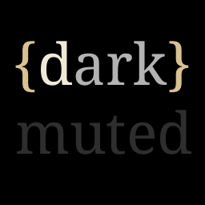
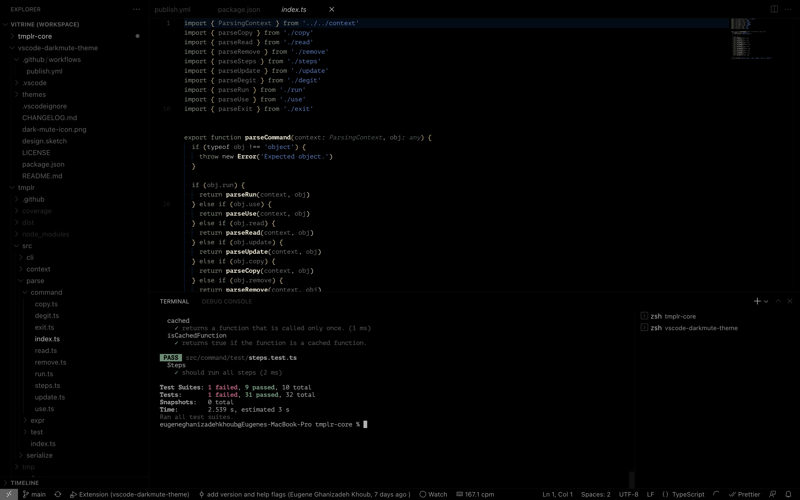

# A Dark and Muted theme for VSCode

Based on [Monochrome Dark Amplified](https://vscodethemes.com/e/anotherglitchinthematrix.monochrome/monochrome-dark-amplified?language=javascript), this color theme provides a bit more than pure monochrome while retaining really low contrast and saturation still. Also I wanted to experiment a bit with bionic style designs to see how easy it will be to read code with such a style.

[👉 Install the Theme](https://vscodethemes.com/e/eugeneghanizadehkhoub.dark-mute/dark-mute?language=javascript)

